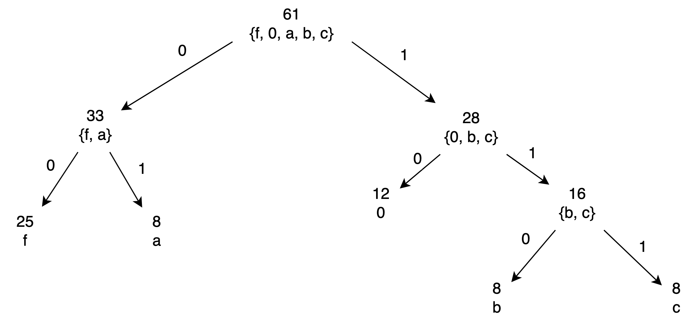

# Mobile Programming and Multimedia - Compression exercise
Lazari Alberto - 2089120

## LZW algorithm
Instead of writing down all the algorithm steps by hand, I've implemented it in a simple shell script. \
The script outputs the dictionary while it's created, as shown in the slides of the lesson, and finally three different encoding results (based on the encoding method).

Here's the source code of the used script and, following, its output.

### Code
```bash
#!/usr/bin/env bash

if [[ $1 == '-c' ]]; then
    compact=true
else
    compact=false
fi

declare -A dict
# Initial code value
code=256

# Table header
echo w$'\t'k$'\t'output$'\t'code =\> symbol
echo ======================================

# Actual algorithm implementation
while read k && [[ -n $k ]]; do
    # Trace the input while reading k
    input="$input $k"

    # Check if wk is in dictionary
    if [[ -n ${dict[$w$k]} ]]; then
        w=$w$k
        # Print extended output only if option -c was not provided
        $compact || echo $w$'\t'$k
    else
        # Add normal characters to dictionary with their own symbol (instead of code)
        if [[ -z ${dict[$k]} ]]; then
            dict+=([$k]=$k)
        fi

        # Do only if it's not the first iteration (w is empty)
        if [[ -n $w ]]; then
            # Add wk => code to dictionary
            # using wk as key makes retrieving the code for printing and existting checks easier
            dict+=([$w$k]=$code)
            echo $w$'\t'$k$'\t'${dict[$w]}$'\t'$code =\> $w$k
            # Trace the encoded sequence
            enc="$enc ${dict[$w]}"
            code=$(( $code + 1 ))
        else
            $compact || echo NULL$'\t'$k
        fi
        w=$k
    fi
done
# Print last line
enc="$enc ${dict[$w]}"
echo $w$'\t'EOF$'\t'${dict[$w]}

echo $'\n'Encoded sequence:
echo $enc

# Compress ratio output
o_size=$(echo $input | wc -w | sed -e 's/[^0-9]*//g')
o_bits=$(( $o_size * 8 ))
echo $'\n'Original size: $o_size bytes \* 8 = $o_bits bits

e_size=$(echo $enc | wc -w | sed -e 's/[^0-9]*//g')

e_bytes=$(echo $enc | sed -e 's/[0-9][0-9][0-9]//g' | wc -w | sed -e 's/[^0-9]*//g')
e_codes=$(echo $enc | sed -e 's/[^0-9 ]//g' | sed -e 's/[^0-9]. / /g' | wc -w | sed -e 's/[^0-9]*//g')

echo $'\n'- ASCII 1 byte, codes 9 bits:
e_bits=$(( $e_bytes * 8 + e_codes * 9 ))
echo "Encoded size: $e_size characters -> $e_bytes characters * 8 + $e_codes codes * 9 = $e_bits bits"
printf 'Encoding ratio: %.3f\n' $(bc -le "$e_bits / $o_bits")

echo $'\n'- 9 bits per character:
e_bits=$(( $e_bytes * 9 + e_codes * 9 ))
echo "Encoded size: $e_size characters * 9 = ($e_bytes characters + $e_codes codes) * 9 = $e_bits bits"
printf 'Encoding ratio: %.3f\n' $(bc -le "$e_bits / $o_bits")

echo $'\n'- ASCII 1 byte, codes 2 bytes:
e_bits=$(( $e_bytes * 8 + e_codes * 16 ))
echo "Encoded size: $e_size characters -> $e_bytes characters * 8 + $e_codes codes * 16 = $e_bits bits"
printf 'Encoding ratio: %.3f\n' $(bc -le "$e_bits / $o_bits")
```

### Output
```
$ echo ffffffff000ffffff00fffff000ffffff00abcabca00bcabcabcabcabcabc | sed -e 's/./&\n/g' | ./lzw-enc.sh -c
w       k       output  code => symbol
======================================
f       f       f       256 => ff
ff      f       256     257 => fff
fff     f       257     258 => ffff
ff      0       256     259 => ff0
0       0       0       260 => 00
00      f       260     261 => 00f
ffff    f       258     262 => fffff
ff0     0       259     263 => ff00
0       f       0       264 => 0f
fffff   0       262     265 => fffff0
00      0       260     266 => 000
0f      f       264     267 => 0ff
fffff0  0       265     268 => fffff00
0       a       0       269 => 0a
a       b       a       270 => ab
b       c       b       271 => bc
c       a       c       272 => ca
ab      c       270     273 => abc
ca      0       272     274 => ca0
00      b       260     275 => 00b
bc      a       271     276 => bca
abc     a       273     277 => abca
abca    b       277     278 => abcab
bca     b       276     279 => bcab
bcab    c       279     280 => bcabc
c       EOF     c

Encoded sequence:
f 256 257 256 0 260 258 259 0 262 260 264 265 0 a b c 270 272 260 271 273 277 276 279 c

Original size: 61 bytes * 8 = 488 bits

- ASCII 1 byte, codes 9 bits:
Encoded size: 26 characters -> 8 characters * 8 + 18 codes * 9 = 226 bits
Encoding ratio: 0.463

- 9 bits per character:
Encoded size: 26 characters * 9 = (8 characters + 18 codes) * 9 = 234 bits
Encoding ratio: 0.480

- ASCII 1 byte, codes 2 bytes:
Encoded size: 26 characters -> 8 characters * 8 + 18 codes * 16 = 352 bits
Encoding ratio: 0.721
```

The script reports three different ways of encoding the final result:
#### Minimum number of bits
Normal characters are encoded in a byte, while sequence codes need an additional bit (because > 255). It's the most efficient, however it cannot be decoded: "Do I need to read 8 or 9 bits now?" $\implies$ Some sort of escaping is needed.

#### 9 bits per character
The easiest one. Every character is encoded using 9 bits, so it's always sure how to obtain the characters during decoding.

#### Byte for characters, two bytes for codes
Using an additional byte for sequence codes, instead of just 9 bits. This can be done, for instance, with UTF-8 encoding, that uses just one byte for ASCII characters and an additional one (or more) to encode Unicode symbols. \
It's more convenient than method (2.) for modern systems, since they usually work with whole bytes, so working with 9 bits sets requires some low level parsing, while UTF-8 is well supported on every system.

Here's the expanded version of the table (with all the steps).
```
w       k       output  code => symbol
======================================
NULL    f
f       f       f       256 => ff
ff      f
ff      f       256     257 => fff
ff      f
fff     f
fff     f       257     258 => ffff
ff      f
ff      0       256     259 => ff0
0       0       0       260 => 00
00      0
00      f       260     261 => 00f
ff      f
fff     f
ffff    f
ffff    f       258     262 => fffff
ff      f
ff0     0
ff0     0       259     263 => ff00
0       f       0       264 => 0f
ff      f
fff     f
ffff    f
fffff   f
fffff   0       262     265 => fffff0
00      0
00      0       260     266 => 000
0f      f
0f      f       264     267 => 0ff
ff      f
fff     f
ffff    f
fffff   f
fffff0  0
fffff0  0       265     268 => fffff00
0       a       0       269 => 0a
a       b       a       270 => ab
b       c       b       271 => bc
c       a       c       272 => ca
ab      b
ab      c       270     273 => abc
ca      a
ca      0       272     274 => ca0
00      0
00      b       260     275 => 00b
bc      c
bc      a       271     276 => bca
ab      b
abc     c
abc     a       273     277 => abca
ab      b
abc     c
abca    a
abca    b       277     278 => abcab
bc      c
bca     a
bca     b       276     279 => bcab
bc      c
bca     a
bcab    b
bcab    c       279     280 => bcabc
c       EOF     c
```

## Shannon-Fano algorithm
### Tree
Here's the tree, resulting from the execution of Shannon-Fano's algorithm on the given sequence



### Table
The table presents the algorithm results, with the encodings of every character

| Character | Occurrences | Code |
|-----------|-------------|------|
|f          |25           |00    |
|0          |12           |10    |
|a          |8            |01    |
|b          |8            |110   |
|c          |8            |111   |

### Code
The encoded sequence and the compress ratio were calculated using another script. Here's the source code:

```bash
#!/usr/bin/env bash

f=00
zero=10
a=01
b=110
c=111

read input

enc=$(echo $input | sed -e 's/./& /g' | sed -e "s/0/$zero/g" | sed -e "s/f/$f/g" | sed -e "s/a/$a/g" | sed -e "s/b/$b/g" | sed -e "s/c/$c/g")
echo Encoded sequence:
echo $enc

# Compress ratio
o_size=$(echo $input | sed -e 's/./& /g' | wc -w | sed -e 's/[^0-9]*//g')
o_bits=$(( $o_size * 8 ))
echo $'\n'Original size: $o_size bytes \* 8 = $o_bits bits

e_bits=$(echo $enc | sed -e 's/[^ ]/& /g' | wc -w | sed -e 's/[^0-9]*//g')
echo Encoded size: $e_bits bits

# Table size
t_bits=$(( 5 * 2 * 8 ))
echo Encoded size \(with table\): \(5 \* 2\) bytes \* 8 = $(( $e_bits + $t_bits )) bits

printf '\nEncoding ratio: %.3f\n' $(bc -le "($e_bits + $t_bits) / $o_bits")
```

### Output
This is the output of the script. It shows the sizes of the original, encoded and encoded + table sequences.

The size of the table is considered to be 1 byte per code and per character. The string uses 5 character, so the table is considered to be 10 bytes large

```
$ echo ffffffff000ffffff00fffff000ffffff00abcabca00bcabcabcabcabcabc | ./shannon-fano.sh
Encoded sequence:
00 00 00 00 00 00 00 00 10 10 10 00 00 00 00 00 00 10 10 00 00 00 00 00 10 10 10 00 00 00 00 00 00 10 10 01 110 111 01 110 111 01 10 10 110 111 01 110 111 01 110 111 01 110 111 01 110 111 01 110 111

Original size: 61 bytes * 8 = 488 bits
Encoded size: 138 bits
Encoded size (with table): (5 * 2) bytes * 8 = 218 bits

Encoding ratio: 0.447
```
